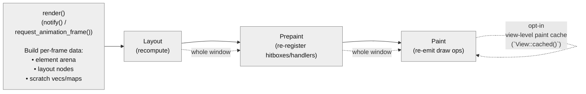
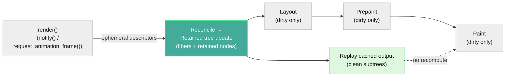

# gpui: Render pipeline overhaul — O(changed) updates, O(1) scroll

## TL;DR

- **What:** GPUI now maintains a persistent fiber tree across frames instead of rebuilding the entire element tree every frame
- **Performance:** Work is proportional to what changed, not total elements — `O(changed)` instead of `O(total)`
- **Impact:** 4-8× CPU reduction during interactions; debug builds go from ~20-40 FPS to 120 FPS
- **Scope:** Cross-platform GPUI core change (macOS, Windows, Linux)
- **API:** Mostly internal with automatic gains; breaking changes for correctness and ergonomics require migration ([details](#api-changes))

## Overview

This PR is a major performance and scalability overhaul of GPUI’s render pipeline.

Previously, *any* view notification forced GPUI to rebuild the entire element tree and recompute layout, prepaint, and paint for **every element in the window**—`O(total elements)` work per frame. With this change, GPUI performs work proportional only to what actually changed—`O(changed elements)`.

A notification that updates a single view no longer triggers a full tree rebuild. Instead, GPUI maintains a **persistent fiber tree** across frames, caches render outputs, and selectively recomputes only the affected subtrees. For complex UIs where most content is static—code editors, data tables, dashboards—this removes the dominant source of unnecessary CPU work.

This is a **cross-platform GPUI core change** that affects all targets (macOS, Windows, Linux). The primary changes are in the shared, CPU-side render pipeline; platform backends received minimal changes to support transform-based scrolling.

The fiber tree and reconciliation algorithm are inspired by React’s architecture [[1]](#references--suggested-reading), adapted for Rust’s ownership model and GPUI’s rendering pipeline. Unlike React, which caches virtual DOM structure, **GPUI caches the actual render outputs**: computed layouts, hit-test regions, input handler registrations, and paint operations. When a subtree is unchanged, GPUI skips *all* of its work—not just element construction.

This directly reduces CPU usage and improves battery life on laptops. Debug builds see especially large FPS gains, since the reduced work compounds with unoptimized code paths—making day-to-day Zed development noticeably smoother.

Beyond performance, persistent fibers significantly simplify GPUI’s internals. Three separate identity systems—element paths, hitbox keys, and layout nodes—collapse into a single `NodeId`-backed identity. Frame-to-frame state transfer is eliminated, the `DispatchTree` merges into the fiber tree, and large amounts of bookkeeping code disappear. The result is not only faster rendering, but a more maintainable and easier-to-reason-about architecture. **This represents one of the most significant changes to GPUI’s core rendering model since the project’s introduction.**

## Results

*TODO: Add side-by-side videos and benchmark numbers (FPS, CPU usage) for release and debug builds across panel resize, scroll, and hover interactions.*

## Architecture (Visual Overview)

**Before** — stateless pipeline: rebuild and recompute the whole window:



**After** — retained pipeline: reconcile, recompute dirty subtrees, replay cached output:



## Architecture (Detailed)

React demonstrated that UI frameworks don’t need to rebuild everything when something changes. By maintaining a persistent tree and diffing against it, you can identify exactly what changed and skip work for everything else.

GPUI adopts this model but goes further. Rather than caching only a lightweight description of what to render, GPUI caches the **results of rendering work itself**: layout, prepaint state, and paint output. Clean fibers replay cached results directly, avoiding recomputation across all phases.

### Time Complexity Improvements

The key shift is from “recompute everything” to “recompute only what’s dirty, replay everything else”.

| Phase / Work Category                 | Before (per-frame rebuild) | After (persistent fibers)                 |
| ------------------------------------- | -------------------------- | ----------------------------------------- |
| Descriptor build (element construction) | `O(total)`                 | `O(changed)` (only notified views/subtrees) |
| Reconcile (diff + retained updates)     | —                          | `O(changed)` (plus ancestor/path bookkeeping) |
| Layout                                  | `O(total)`                 | `O(changed)` (dirty subtrees only)        |
| Prepaint (hitboxes/handlers/tooltips)   | `O(total)`                 | `O(changed)` (dirty subtrees only)        |
| Paint command generation                | `O(total)` (with limited opt-in view-level reuse) | `O(changed)` + cached replay for clean subtrees |
| Input dispatch lookups                  | often non-constant / indirect | stable per-node storage (typically `O(1)` lookups) |

### Allocation Reductions

This reduces per-frame allocation churn by making most “render outputs” and “interaction registrations” persistent and incrementally updated.

| Allocation Category                       | Before                       | After                                  |
| ----------------------------------------- | ---------------------------- | -------------------------------------- |
| Per-frame scratch collections (inputs/hover/tooltips/cursors) | rebuilt each frame            | stored per node and updated incrementally |
| Paint outputs (draw ops / scene segments) | regenerated each frame (except opt-in `View::cached()` reuse) | cached per subtree and replayed when clean |
| Layout caches                             | mostly ephemeral / rebuilt   | cached per node and invalidated selectively |
| Identity bookkeeping                      | multiple parallel systems    | single stable per-node identity + cached metadata |

This reduces both per-frame allocation churn and baseline memory usage.

### Render Pipeline

Rendering proceeds in four phases, each with its own caching/skip logic. Change detection happens during **reconcile** via direct style comparison and structure diffing.

0. **Reconcile** — build ephemeral descriptors (elements), diff them against the retained tree, update retained nodes, and compute dirty flags.
   - **Change detection:** descriptors expose their style directly; the framework compares layout-affecting and paint-affecting properties against cached values.
   - **Measured elements:** for elements with dynamic content (e.g., text), measurement signatures record actual measured sizes. A probe pass re-measures to detect actual size changes, avoiding false layout invalidations when content changes but rendered size remains the same.
   - A style mismatch, size change, or structure change marks a fiber dirty and schedules the appropriate work. Unchanged siblings and cousins are skipped entirely.
1. **Layout** — size and position computation, driven by cached styles and leaf measurement via retained nodes.
2. **Prepaint** — hit testing, input handlers, tooltips, cursors, and other interaction state. Cached state is replayed when clean.
3. **Paint** — draw command emission. Cached scene segments and paint lists are reused when unchanged.

Each phase is tracked independently. Layout and paint output are cached independently; an element may require re-layout without regenerating its paint output (cached draw commands can be replayed with updated bounds), or vice versa.

#### Reconcile (New Phase)

Before this PR, GPUI did not have a reconciliation phase at all: a view notification meant rebuilding the entire ephemeral element tree for the frame and then running layout/prepaint/paint over it.

With persistent fibers, GPUI introduces **reconcile** as a new, explicit phase that bridges the ephemeral descriptor layer (elements) and the retained layer (fibers + render nodes).

**Key property:** reconcile is the only phase allowed to:

- mutate the fiber tree structure (create/remove/relink children)
- create/replace/update retained nodes
- update layout styles and leaf measurement configuration
- compute and propagate dirty flags based on descriptor diffs

After reconcile, the retained tree is structurally stable for layout/prepaint/paint. This makes the renderer easier to reason about, enables better diagnostics (“why did this re-render?”), and provides stable snapshot points for tooling.

#### Retained Render Nodes (Element/Fiber Decoupling)

To keep fiber traversal generic (no per-element switch statements) and make element behavior extensible, this PR introduces **retained render nodes**:

- **Elements become descriptors**: ephemeral values produced by `render()` that describe identity (`VKey`), style, and children.
- **RenderNodes become the retained layer**: persistent objects stored on fibers that own all element-specific state (interactivity, text shaping caches, SVG parameters, anchored config, etc.) and implement begin/end scope-based lifecycles for prepaint/paint.
- **Generic traversal**: fiber traversal no longer needs per-element paint/prepaint implementations; it calls `RenderNode::{prepaint_begin,prepaint_end,paint_begin,paint_end}` and replays cached output generically.

For third-party / legacy elements that don't provide a retained node, GPUI falls back to a "legacy element" escape hatch (always-dirty, correctness-first) while opting out of incremental caching.

#### Scene Segments and Transforms

To support incremental paint output, this PR introduces `SceneSegmentPool`—a persistent, ID-stable pool of scene segments that live across frames.

**SceneSegmentPool:**
- Each fiber's paint output is stored in a `SceneSegment` identified by `SceneSegmentId`
- Segments are retained across frames; unchanged fibers replay their cached segment without regenerating draw commands
- The pool tracks mutation epochs per segment, enabling future GPU-side caching (skip re-upload for unchanged segments)
- Segment lifecycle is tied to fiber lifecycle—segments are allocated on fiber creation and released on fiber removal

**Transform infrastructure:**
- `TransformTable` manages a persistent table of 2D transforms, each identified by `TransformId`
- Transforms can be updated (scroll offset changes) without invalidating paint output
- Platform backends pipe transforms to the GPU, enabling GPU-accelerated scroll offset without CPU-side scene regeneration
- The transform hierarchy is flattened into absolute transforms for efficient GPU consumption

Together, these enable O(1) scroll: the fiber tree structure and paint output stay cached, only the transform offset changes.

#### O(1) Scroll

Scrolling is treated as a transform change rather than a content change. Descendants retain their cached output since only the scroll offset moved—their local geometry is unchanged. A list with 10,000 items scrolls with the same CPU cost as one with 10.

**Editor scrolling** uses a buffer strategy: render visible lines plus padding above/below, scroll via transform offset within the buffer, re-render only when scroll exceeds buffer bounds. This makes editor scroll O(1) for the common case—a 100,000-line file scrolls with the same CPU cost as a 100-line file. The improvement is especially pronounced in debug builds, where the reduced work compounds with unoptimized code paths.

### Custom Elements

Custom or legacy elements that don't provide a retained render node always re-render. This preserves correctness while allowing built-in elements to realize the full `O(changed)` benefits.

## API Changes

Most changes are internal. Existing GPUI applications continue to work with no or minimal code changes while automatically gaining performance benefits.

### Removed: `AnyView::cached()`

`AnyView::cached()` has been removed. Caching is now automatic at the element level—views are only re-rendered when their state changes via `cx.notify()`.

**Migration:** Remove `.cached(...)` calls entirely.

### `window.clear()` / `ArenaClearNeeded`

`window.clear()` and the `ArenaClearNeeded` return type have been removed. These were tied to the per-frame element arena, which no longer exists in the fiber architecture. `Window::draw()` now returns `()` instead of `ArenaClearNeeded`. Usage is rare and most applications are unaffected.

### `window.dispatch_pending_focus_events()`

A new method `Window::dispatch_pending_focus_events(&mut self, cx: &mut App)` allows dispatching focus change events without performing a full draw cycle.

**Background:** Previously, focus change events were only dispatched during `finalize_frame()` at the end of `window.draw()`. This meant that code needing to process focus changes between programmatic operations (e.g., vim mode processing multiple keystrokes) had to call `window.draw()` as a workaround.

**Why fibers enable this:** In the fiber architecture, the focus path can be computed at any time from the persistent fiber tree. This enables lightweight focus event dispatch without requiring a full layout/prepaint/paint cycle—something that was not possible in the old per-frame rebuild architecture where computing the focus path required rebuilding the element tree.

**Migration:** Replace `window.draw(cx)` calls that exist solely to flush focus events with `window.dispatch_pending_focus_events(cx)`.

### Identity Unification

`GlobalElementId` is now an alias of Taffy's `NodeId`. `HitboxId` is a thin wrapper around `NodeId` to preserve API ergonomics. Inspector identifiers now pair `GlobalElementId` with source location for stability.

### `.id()` Optional

Explicit `.id()` calls are no longer required for event handlers. Existing code continues to work unchanged.

### Removed: `Stateful<E>` Wrapper and `StatefulInteractiveElement` Trait

The `Stateful<E>` wrapper type and `StatefulInteractiveElement` trait have been removed. All methods formerly on `StatefulInteractiveElement` are now on `InteractiveElement`.

```rust
// Before: .id() returned Stateful<Div>, gating access to stateful methods
let element: Stateful<Div> = div().id("my-element");
element.on_click(|_, _, _| {}); // Only on StatefulInteractiveElement

// After: .id() returns the same type, all methods on InteractiveElement
let element: Div = div().id("my-element");
element.on_click(|_, _, _| {}); // On InteractiveElement
```

**Why this change:** `Stateful<E>` existed to enforce at compile time that certain methods (like `on_click`, `on_drag`, `on_scroll_wheel`) could only be called on elements with an explicit ID. In the fiber architecture, the fiber tree provides identity automatically—explicit IDs are no longer required for stateful behavior. The wrapper becomes unnecessary complexity.

**Migration:**
- Change `Stateful<Div>` type annotations to `Div`
- Remove `StatefulInteractiveElement` from imports
- Remove `impl StatefulInteractiveElement for T {}` blocks

Most code uses type inference and requires no changes. Only code with explicit `Stateful<Div>` type annotations needs updating.

### `canvas()` Signature Change

The `canvas()` element's paint callback signature changed from consuming `T` to taking `&mut T`:

```rust
// Before: prepaint returns T, paint consumes T
canvas(
    |bounds, window, cx| -> T { ... },
    |bounds, data: T, window, cx| { ... },
)

// After: both callbacks share mutable access to persistent state
canvas(
    |bounds, state: &mut T, window, cx| { ... },
    |bounds, state: &mut T, window, cx| { ... },
)
```

**Why this change was necessary:** The old "prepaint produces, paint consumes" model assumed single-pass rendering where each frame is independent. In a retained/fiber system, elements persist across frames and paint can occur without prepaint (e.g., during cached replay or partial invalidation). The `FnOnce` callbacks would panic when called multiple times.

**Migration:** Call sites need mechanical updates—instead of producing and consuming `T`, use `&mut T` to read/write persistent state.

### `on_layout()` Replaces Canvas for Bounds Tracking

Previously, `canvas()` was commonly used throughout Zed purely to capture element bounds during layout, with an empty paint callback:

```rust
// Before: canvas misused for layout measurement
canvas(
    move |bounds, window, cx| {
        bounds_cell.set(bounds);  // capture bounds in prepaint
    },
    |_, _, _, _| {},  // empty paint callback
)
.size_full()
.absolute()
```

The new `on_layout()` method on `Div` provides a cleaner, purpose-built API for this pattern:

```rust
// After: dedicated layout callback
div()
    .size_full()
    .absolute()
    .on_layout(move |bounds, window, cx| {
        bounds_cell.set(bounds);
    })
```

**Migration:** Replace `canvas(|bounds, ...| { ... }, |_, _, _, _| {})` patterns with `div().on_layout(|bounds, ...| { ... })`. This was applied throughout Zed in picker, workspace, context menus, and other components that needed to track element bounds.

### Removed: `deferred()` function → `.z_index()` method

The `deferred()` wrapper function and `Deferred` element have been removed. Use the `.z_index()` method on any element instead:

```rust
// Before
deferred(
    anchored()
        .position(position)
        .child(menu.clone())
).priority(1)

// After
anchored()
    .position(position)
    .child(menu.clone())
    .z_index(1)
```

**Why this change:** "Deferred" was an implementation detail (elements painted in a later pass) that leaked into the public API. The new `.z_index()` method aligns with CSS/Tailwind terminology and clearly communicates intent: higher values appear on top. The method is available on all elements via the `IntoElement` trait.

**Migration:** Replace `deferred(element).priority(n)` or `deferred(element).with_priority(n)` with `element.z_index(n)`. For `deferred(element)` without a priority, use `element.z_index(0)`.

### Removed: `WithRemSize` element → `.rem()` method

The `WithRemSize` wrapper element has been removed from the `ui` crate. Use the `.rem()` method on `div()` instead:

```rust
// Before
WithRemSize::new(ui_font_size).occlude().child(content)

// After
div().rem(ui_font_size).occlude().child(content)
```

**Why this change:** Like `deferred()`, `WithRemSize` was a wrapper element that existed solely to set a single property (the rem size context) for its descendants. The new `.rem()` method on `InteractiveElement` integrates this capability directly into div elements, reducing wrapper nesting and aligning with the fluent API style used throughout GPUI.

**How it works:** The rem size is pushed onto a stack during layout/prepaint/paint and popped when the element's scope ends. All descendants use this rem size for unit conversions until another `.rem()` overrides it.

**Migration:** Replace `WithRemSize::new(size).child(content)` with `div().rem(size).child(content)`. Note that `WithRemSize` was in the `ui` crate, while `.rem()` is available on all `InteractiveElement` types in GPUI.

### Removed: `image_cache()` wrapper function → `.image_cache()` method

The `image_cache()` wrapper function and `ImageCacheElement` have been removed. Use the `.image_cache()` method on `div()` instead:

```rust
// Before
image_cache(retain_all("cache")).child(content)

// After
div().image_cache(retain_all("cache")).child(content)
```

**Why this change:** The `.image_cache()` method already existed on `InteractiveElement`, making the wrapper function redundant. This follows the same pattern as the `deferred()` → `.z_index()` and `WithRemSize` → `.rem()` changes.

**Migration:** Replace `image_cache(provider).child(content)` with `div().image_cache(provider).child(content)`.

### Removed: `StyledText::new()` and `InteractiveText::new()` → `TextElement` trait

The `StyledText::new()` and `InteractiveText::new()` constructors have been removed. Use the fluent methods from the `TextElement` trait directly on strings instead:

```rust
// Before: StyledText
StyledText::new(label).with_default_highlights(&style, highlights)

// After: fluent method on string
label.with_default_highlights(&style, highlights)

// Before: InteractiveText
InteractiveText::new(
    element_id,
    StyledText::new(text).with_default_highlights(&style, highlights)
)
.on_click(ranges, |ix, window, cx| { ... })
.tooltip(|ix, window, cx| Some(view))

// After: fluent chaining, no ID required
text.with_default_highlights(&style, highlights)
    .on_click(ranges, |ix, window, cx| { ... })
    .tooltip(|ix, window, cx| Some(view))
```

**Why this change:** The old API required awkward nesting (`InteractiveText::new(id, StyledText::new(...))`) and explicit element IDs. In the fiber architecture, element IDs are no longer needed for interactive text—the fiber provides identity for state storage and hitbox registration. The new fluent API is more ergonomic and aligns with how other GPUI elements work.

**Available methods on `TextElement` trait:**
- `.with_highlights(highlights)` — apply highlight styles, resolved at render time
- `.with_default_highlights(&style, highlights)` — apply highlights with explicit base style
- `.with_runs(runs)` — set pre-computed text runs directly
- `.on_click(ranges, handler)` — register click handler for character ranges
- `.on_hover(handler)` — register hover handler with character index
- `.tooltip(builder)` — register tooltip builder for character index

**Implemented for:** `&'static str`, `String`, `SharedString`, `StyledText`, `InteractiveText`

**Migration:**
- `StyledText::new(text).with_highlights(...)` → `text.with_highlights(...)`
- `StyledText::new(text).with_default_highlights(...)` → `text.with_default_highlights(...)`
- `InteractiveText::new(id, styled_text)` → remove the ID, chain methods directly on text

## Comparison: React Native Shadow Tree

The architectural split introduced here is similar in spirit to React Native’s **Shadow Tree** [[2]](#references--suggested-reading):

- React Native: JS/React produces a declarative description → Shadow Tree retains layout/state → renderer mounts/draws.
- GPUI (after this PR): views produce ephemeral element descriptors → **reconcile** updates a retained fiber + RenderNode tree → layout/prepaint/paint operate on the retained tree.

The key difference is what is cached: GPUI’s retained layer caches not only layout data but also prepaint state (hitboxes/handlers) and paint output (scene segments/paint lists), enabling `O(1)` replay for unchanged subtrees.

## Open Questions

### Rollout Strategy

* Should this land behind Preview/Nightly before Stable?
* What metrics should gate promotion to Stable?

## Future Work

### Tooling & Diagnostics

* Expand the inspector’s component-tree projection (views + component boundaries + host nodes)
* "Why did this re-render?" tracing using reconcile/dirty provenance

### Guardrails

* Tests or runtime checks to detect accidental `O(total)` regressions
* Leak/regression monitoring for retained caches (e.g. fiber/node lifecycle, cached paint output growth)

### Rendering & Performance

* Spatial index for hit testing
* Effect dependency tracking
* Extending change detection to custom elements

### Incremental GPU Pipeline (Planned)

The fiber architecture makes CPU-side work O(changed), but GPU batching and uploads still happen every frame. This follow-up makes GPU work incremental too:

1. **Cache batch boundaries per segment** — `Scene::batches()` re-scans every segment each frame. Store precomputed `Vec<SegmentBatch>` inside each `SceneSegment`, rebuilt only when mutated.

2. **Persist GPU buffers per segment** — Today every backend streams instance data every frame even for cached/replayed segments. Implement per-backend `SegmentGpuCache` keyed by `SceneSegmentId`: skip upload if segment epoch unchanged, just bind + draw.

3. **Incremental transform uploads** — `TransformTable::to_gpu_transforms()` rebuilds and uploads the entire transform buffer every frame. Add dirty tracking + persistent GPU buffer, update only changed ranges.

4. **Optional: encode caching / render bundles** — Cache command encoding for unchanged segments if backend supports it.

**Expected impact:**
- Static UI frames: near-zero instance uploads
- Hover/cursor changes: uploads limited to mutated segments
- Scroll: mostly transform-buffer updates, not full scene re-upload

No public API changes required — all changes are inside `Scene`/`SceneSegmentPool` and platform renderers.

## References / Suggested Reading

1. What is React Fiber — [https://sunnychopper.medium.com/what-is-react-fiber-and-how-it-helps-you-build-a-high-performing-react-applications-57bceb706ff3](https://sunnychopper.medium.com/what-is-react-fiber-and-how-it-helps-you-build-a-high-performing-react-applications-57bceb706ff3)
2. React Native mounting (Shadow Tree → mounting) — [https://github.com/facebook/react-native/tree/main/packages/react-native/ReactCommon/react/renderer/mounting](https://github.com/facebook/react-native/tree/main/packages/react-native/ReactCommon/react/renderer/mounting)
3. Taffy documentation — [https://docs.rs/taffy/latest/taffy/](https://docs.rs/taffy/latest/taffy/)
4. SlotMap documentation — [https://docs.rs/slotmap/latest/slotmap/](https://docs.rs/slotmap/latest/slotmap/)
